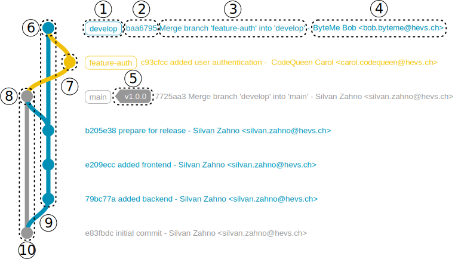

# Answers of Florent Gulas 14flow

## Basics
### Task 1

Les valeurs ont été changées (sont visibles dans les unstage fils) mais n'ont pas été commit ni push

### Task 2

1. Il signifie que les données de answer.md ont été commit avec les valeurs entrées précédemment (nom prénom, nom d'utilisateur et task 1).
2. Non, il est impératif d'entrer un message
3. Le titre du dépot  (qui devient le message du commit) et les valeurs qui le compose
4. Non, car le fichier n'a pas encore été push

### Task 3

Nous avons maintenant deux unstage files : celui où l'on rempli les réponses des exercices 2 et 3 ainsi qu'un unstracked file (que l'on vient de créer)

### Task 4

Quand on revient au commit « Initial commit », le projet revient à son tout premier état : seuls les fichiers du début sont visibles, et on se retrouve en mode "détaché", c'est-à-dire hors de notre branche principale. En revenant au dernier commit (par exemple avec git checkout main), on retrouve l’état le plus récent du projet, avec tous les fichiers et modifications, et on revient sur la branche principale.

### Task 5

Le dépôt local correspond à la copie de notre projet stockée sur notre ordinateur. Ceci nous permet de travailler directement sur ce dernier. Le dépôt distant est, quant à lui, une version de notre projet hébergée sur un serveur (dans notre cas GitHub) afin de le partager et de collaborer avec d'autres personnes.

Si nous le supprimons, nous perdons l'ensemble de notre travail présent dans la mémoire de notre ordinateur. Cependant, le dépôt distant reste intact et nous pouvons récupérer le projet en le clonant à nouveau de puis l'hébergement.

### Task 6

Non, seul notre propre projet (notre forke) a été modifié. Afin de modifiée l'originel, il faut réaliser une "pull request" qui doit être acceptée par le pocésseur du dépot originel.

## Gitgraph

### Task 7

1. branche

2. hash de commit

3. message de commit

4. auteur du commit

5. tag

6. last commit

7. feature-auth branch

8. last commit main branch

9. develop branch

10. main branch
 
 

